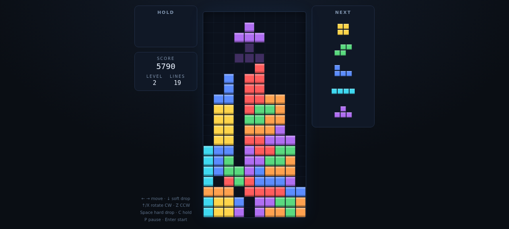

# 🕹️ Tetris

A full modern-classic Tetris clone in vanilla JavaScript — no dependencies, no build step.



## Play

- **Online:** see the GitHub Pages URL (this repo's Pages site)
- **Local:** open `index.html` directly in a browser, or:
  ```sh
  python3 -m http.server 8000   # then visit http://localhost:8000
  ```

## Controls

| Key | Action |
|---|---|
| ← / → | Move (DAS/ARR auto-repeat) |
| ↓ | Soft drop (+1/cell) |
| ↑ or X | Rotate CW |
| Z | Rotate CCW |
| Space | Hard drop (+2/cell) |
| C or Shift | Hold piece |
| P / Esc | Pause / resume |
| Enter | Start / restart |

On touch devices, on-screen buttons appear automatically.

## Ruleset (Tetris Guideline)

- SRS rotation with full official wall-kick tables (JLSTZ + I)
- 7-bag randomizer (seeded mulberry32 PRNG — deterministic per seed)
- Hold piece (no double-hold), ghost piece, next queue of 5
- Scoring: single/double/triple/tetris, T-spin & mini T-spin detection
  (3-corner rule + last-move-was-kick), back-to-back ×1.5, combo bonus
- Guideline gravity curve `(0.8 − (L−1)·0.007)^(L−1)` s/row, level = ⌊lines/10⌋+1
- 500 ms lock delay with move-reset cap of 15

## Project layout

```
index.html        single page (dark theme, responsive, mobile touch controls)
js/engine.js      pure game logic — no DOM. ESM.
js/srs.js         SRS shapes + official wall-kick tables
js/ui.js          canvas rendering, keyboard/touch input, HUD
js/autoplayer.js  heuristic AI (validation tooling; also fun to watch)
tests/            node:test unit tests (44 tests)
CONTRACT.md       the API contract all phases were built against
```

## Tests

```sh
npm test          # node --test tests/ — no dependencies needed
```

Covers: 7-bag determinism, SRS rotations & wall kicks (exact x/y/rot), line
clears & scoring table, T-spin/mini-T-spin detection, back-to-back + combo,
hold rules, ghost piece, gravity/lock-delay timing, game over, and a full
autoplayer game to game-over.

## Validation performed

- 44/44 unit tests green (Node `node:test`)
- SRS kick tables hand-verified against the official guideline data
- Autoplayer: 10 seeded games played to game-over — no exceptions, all clear
  types (single/double/triple/tetris) reached, level-ups verified
- Headless-browser E2E: real keypresses start/pause/restart; autoplayer driven
  through the live page UI to line clears and game over; ghost piece verified
  at pixel level (alpha 82/255 ≈ 0.32)
